<p align="center">
  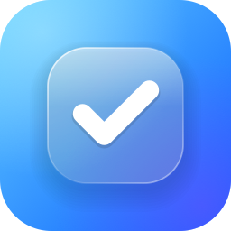
</p>

<h1 align="center">Tik for Android</h1>

<p align="center">
  A minimal, glassy to-do app for Android phones and tablets.<br>
  Built with Kotlin, Jetpack Compose and Material 3, with see-through glass bars and buttons.
</p>

<p align="center">
  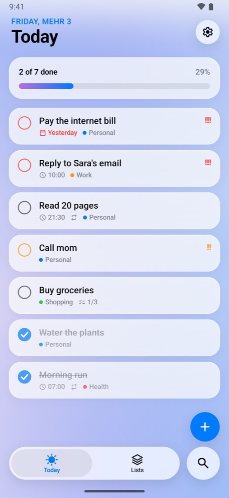
  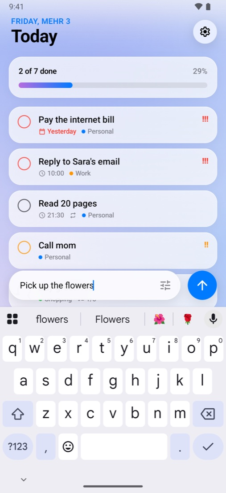
  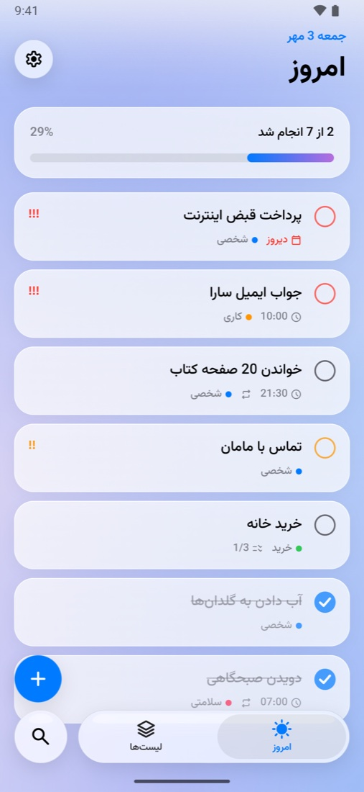
</p>

Also on iPhone and iPad: [Tik for iOS](https://github.com/MahyarMozafar/tik-todo-ios).

## Features

- **Today** — what is due today and anything that is late, with a progress bar. Done tasks slide to the bottom, and the last one of the day gets a burst of confetti.
- **Quick add** — the glass **+** button melts into a text field. It stays open after each task, so a whole day can be typed in one go.
- **Glass** — the tab bar, buttons and top bars are glass: what scrolls behind them is blurred (Android 12 and newer). On Android 13 and newer, touching the tab bar turns the selection into a clear drop of glass that bends the icons under it.
- **Lists** — an Inbox and your own lists with a color and an icon, plus smart lists: Today, Scheduled, All and Completed. Drag lists to put them in order.
- **Task details** — notes, subtasks, a day and a time, priority, a photo, and repeats: every day, certain weekdays, every few days, every week, month or year. Ticking a repeating task adds the next one on the right day.
- **Swipes** — swipe a task one way to tick it, the other way to move it to tomorrow or delete it. Press and hold for more.
- **Reminders** — notifications with **Mark as Done** and **Remind Me in 10 Minutes** buttons that work without opening the app. They come back after the phone restarts.
- **Widget** — a Home Screen widget from 2 × 2 up to 4 × 4 that shows as many of today's tasks as fit. Tasks can be ticked right on the widget, and **+** opens quick add.
- **English and فارسی** — switch the language inside the app, whatever the phone's language is. Farsi is fully right-to-left, with the Vazirmatn font.
- **Shamsi or Gregorian calendar** — Shamsi is the default, weeks start on Saturday, and numbers always use English digits.
- **Make it yours** — light, dark or system theme, 11 accent colors or the colors of your wallpaper, 6 app icons (with a themed icon on Android 13 and newer), haptics, sounds, how Today is sorted, and any task detail you don't use can be turned off.
- **Phones and tablets** — a floating tab bar on phones, a sidebar with search on tablets.

## Screenshots

**Light**

<p align="center">
  
  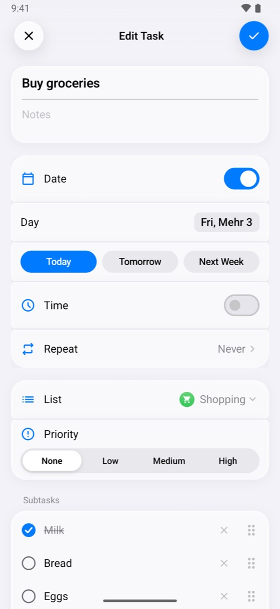
  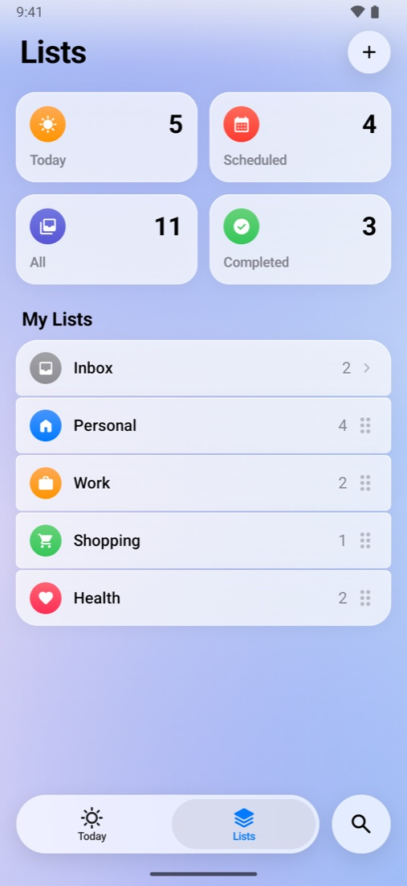
  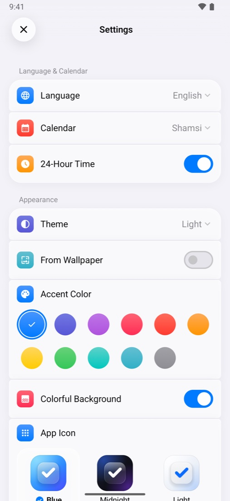
</p>

**Dark**

<p align="center">
  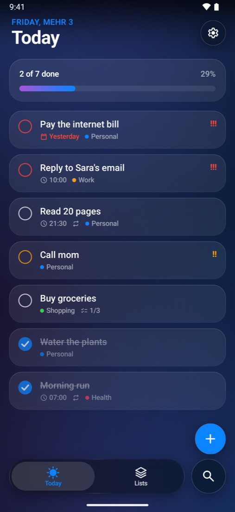
  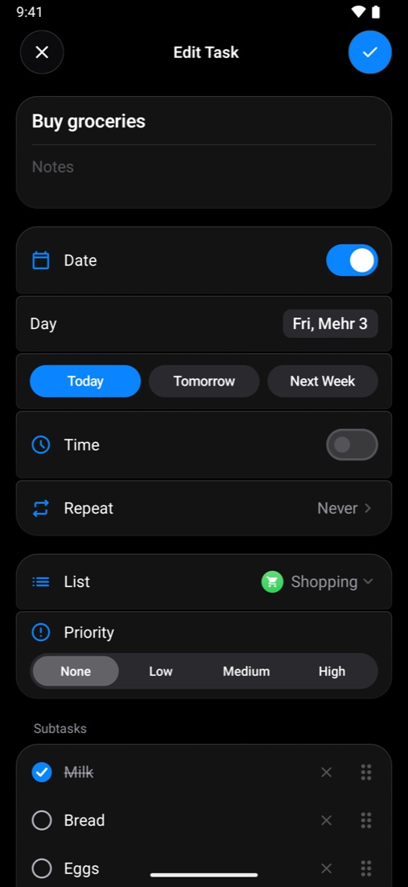
  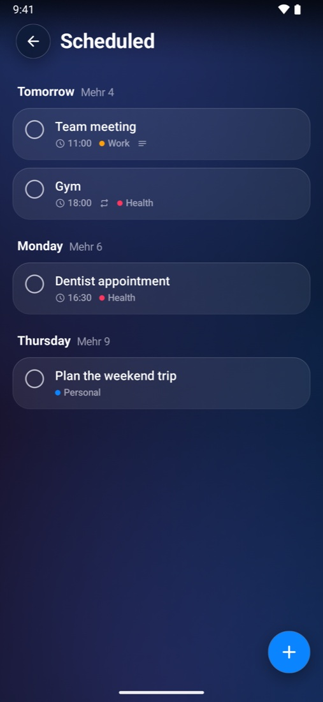
  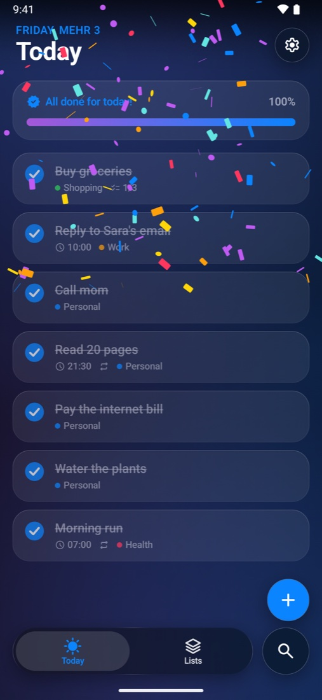
</p>

**فارسی**

<p align="center">
  
  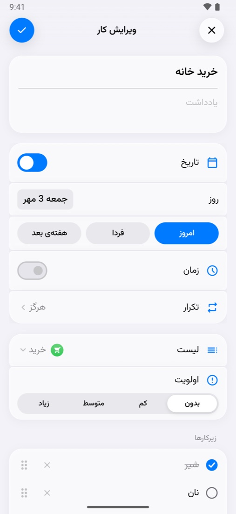
  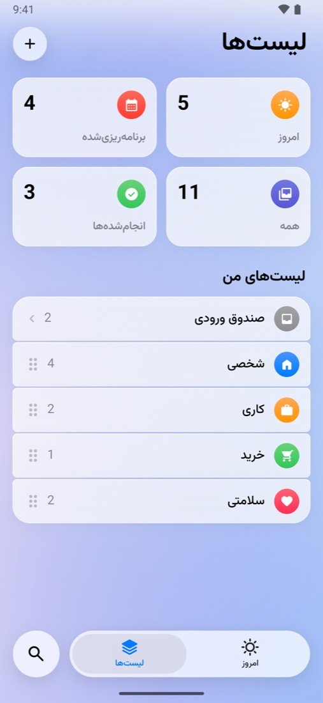
  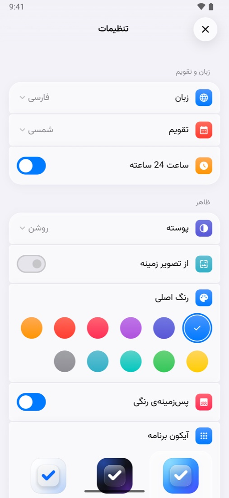
</p>

**Widgets and tablet**

<p align="center">
  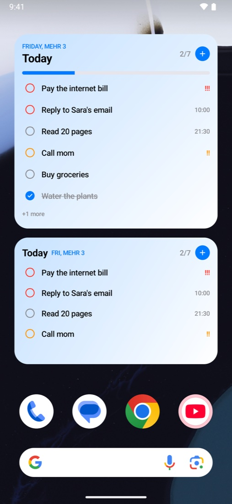
  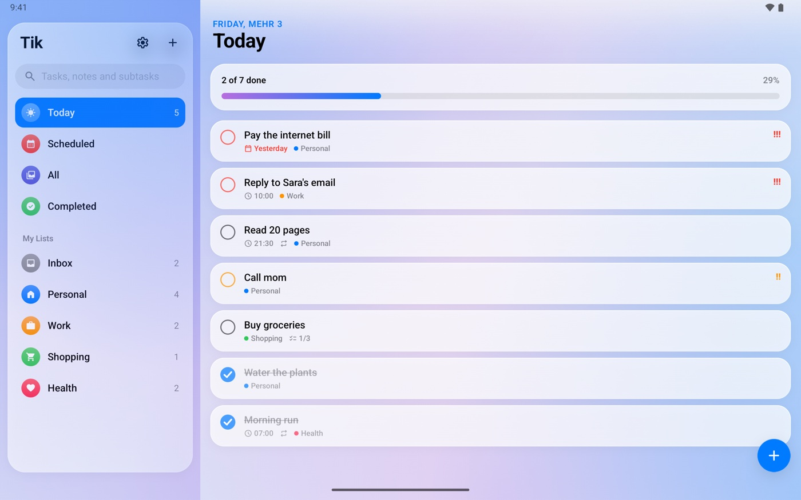
</p>

## How it's built

| | |
| --- | --- |
| UI | Jetpack Compose and Material 3, with the Material 3 Expressive springs, and Navigation 3 |
| Glass | [Haze](https://github.com/chrisbanes/haze): blur on Android 12+, bent light on Android 13+, and a plain see-through look on older phones |
| Data | Room for tasks and lists, DataStore for settings |
| Widget | Jetpack Glance, with an action that ticks a task without opening the app |
| Reminders | Exact alarms and notifications with action buttons, scheduled again after a restart or a time zone change |
| Languages | English and Farsi strings, switched inside the app with Android's per-app language |
| Calendar | A small Shamsi calendar, checked against ICU (which iOS uses) for every day from 1900 to 2100 |
| Tests | 48 unit tests and 10 tests that run on a phone, including the main flows |

The app icons are drawn by `scripts/make-icons.py`, the two sounds are made from math by `scripts/make-sounds.py`, and `scripts/get-icons.sh` downloads the Material Symbols the app uses.

```
app/src/main/java/com/mahyarmozafar/tik/
  model/      Tasks, lists, repeats and settings
  logic/      What shows on each screen, and what ticking a task does
  time/       The Shamsi calendar and date formatting
  data/       Room database, photos and settings
  app/        The app model that every change goes through
  reminders/  Alarms, notifications and the count on the icon
  widget/     The Home Screen widget
  ui/         Screens, glass and components
```

## Install it on your phone

1. Download the latest `.apk` from [Releases](https://github.com/MahyarMozafar/tik-todo-android/releases) on your phone.
2. Open it. If Android asks, allow your browser or file manager to install apps.
3. Tap **Install**. Updates install the same way, and your tasks stay where they are.

Android 8.0 or newer is needed.

## Build it yourself

Open the project in Android Studio, or build from the command line with JDK 17 or newer:

```sh
./gradlew assembleDebug
```

Release builds are signed with a key that is not in this repo. To make your own, put its path and passwords in `~/.gradle/gradle.properties` as `tik.keystore`, `tik.keystorePassword`, `tik.keyAlias` and `tik.keyPassword`, then run `./gradlew assembleRelease`.

## Tests

```sh
./gradlew testDebugUnitTest            # on the computer
./gradlew connectedDebugAndroidTest    # on a phone or emulator
```

- Debug builds accept launch options for example tasks and screenshots, for example
  `adb shell am start -n com.mahyarmozafar.tik/.MainActivity --ez demo true --es lang fa --es theme dark`.
- `scripts/take-screenshots.sh` takes the pictures above on a running emulator.

## License

MIT — see [LICENSE](LICENSE).
The Vazirmatn font is by Saber Rastikerdar, under the SIL Open Font License. The icons are Material Symbols by Google, under the Apache License 2.0.
